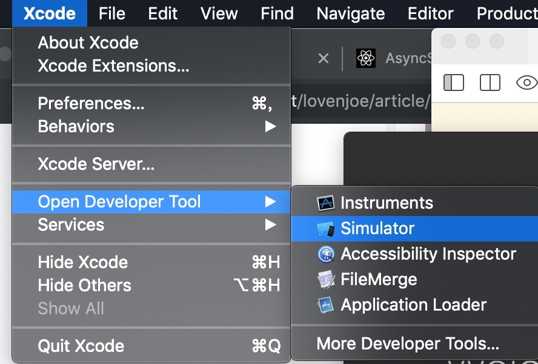
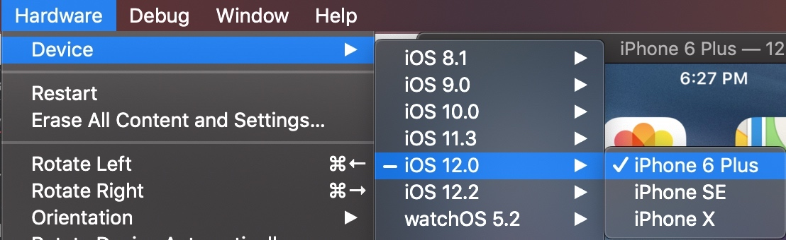
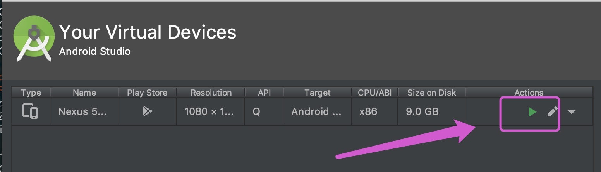

# 一、配置 flutter 环境

[Flutter开发者网站 . 英文](https://flutter.dev/docs/get-started/install/macos)

[Flutter中文网](https://flutterchina.club/setup-macos/)

[Flutter实战](https://book.flutterchina.club/chapter1/install_flutter.html)

## 下载 Flutter SDK:

1、从 [Flutter SDK 发行页](https://flutter.io/sdk-archive/#macos) 下载SDK

2、将下载下来的压缩文件解压到指定的位置，如下：

```
$ cd ~/Applications
$ unzip ~/Desktop/flutter_macos_1.22.5-stable.zip
```

3、将Flutter添加到PATH中需要配置环境变量：

关于软件包的临时镜像路径，请参考[在中国使用Flutter](https://flutter.dev/community/china)

```
$ vi ~/.zshrc

// 将flutter工具添加到您的路径
export PATH="$PWD/Applications/flutter/bin:$PATH"

// 国内用户需要配置Flutter依赖项和软件包的临时镜像路径
export PUB_HOSTED_URL=https://pub.flutter-io.cn
export FLUTTER_STORAGE_BASE_URL=https://storage.flutter-io.cn

// 刷新当前窗口
$ source  ~/.zshrc
```

```
// 验证该命令是否可用
$ cd ~
$ which flutter

// 验证“flutter/bin”是否已在PATH中：
$ echo $PATH

// 运行以下命令以查看是否需要安装任何依赖项才能完成设置，需要安装 Android studio 和 Xcode
// 检查出需要安装什么依赖项就及时安装，然后再通过此命令验证
$ flutter doctor
```


## 平台配置
安装 Android studio

遇到问题，参考：[掘金](https://juejin.im/post/5cd27211518825457b528186)

需要安装插件：
```
启动Android Studio。
打开插件首选项 (macOS：Preferences>Plugins, Windows：File>Settings>Plugins)。
选择 Browse repositories…，选择 flutter 插件并点击 install。
重启Android Studio后插件生效。
```

## 创建并运行一个简单的Flutter应用

1、先运行起来一个模拟器
iOS：`open -a Simulator` 或者 






点击`Android Studio`中的上方菜单`tool`->`AVD Manager`选项




2、创建一个flutter项目并运行
```
$ cd ~/Desktop
$ flutter create my_app
$ cd my_app
$ flutter run
```

快捷键

* r 键：点击后热加载，也就算是重新加载吧。
* p 键：显示网格，这个可以很好的掌握布局情况，工作中很有用。
* o 键：切换android和ios的预览模式。
* q 键：退出调试预览模式。


## 升级 Flutter

1、以下命令来更新 Flutter SDK：

``` 
$ flutter upgrade 
```

此命令获取当前 Flutter 通道上可用的、最新版本的Flutter SDK。
如果要更新到最新版本的Flutter SDK，请切换到不稳定的Flutter通道，然后运行本命令。

2、Flutter 通道

`Flutter`有四个发布渠道：`stable`(稳定版), `beta`(测试版), `dev`(开发者), 和 `master`(主干)。我们建议使用 `stable` 通道，除非需要更新的版本。

要查看当前通道，请使用以下命令：

```
$ flutter channel
```

如下切换通道，然后下载 Flutter SDK 和 dependent packages ：

```
$ flutter channel dev
$ flutter upgrade
```

如果需要特定版本的 Flutter SDK，可从 [Flutter SDK releases](https://flutter.dev/docs/development/tools/sdk/releases?tab=macos) 下载它。

3、升级 packages

如果你修改了  pubspec.yaml 文件，或者只想更新应用程序依赖的 packages（而不是 packages 和 Flutter 本身），请使用flutter pub命令之一。

要更新到 pubspec.yaml 文件中列出的所有依赖项的最新兼容版本，请使用upgrade命令：

```
$ flutter pub upgrade
```

要标识过时的 package 依赖关系并获取有关如何更新它们的建议，请使用过时的命令。 有关详细信息，请参见[Dart发布过时的文档](https://dart.dev/tools/pub/cmd/pub-outdated)。

```
$ flutter pub outdated
```


## 学习博客


[DartPad Dart 在线演示](https://dartpad.dartlang.org/?)