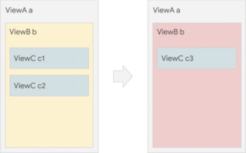
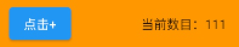

# 二、Flutter基础

## 声明式UI

从`Win32` 到 `web` 再到 `Android` 和 `iOS` 的框架通常使用 命令式UI(`imperative style of UI`) 编程。可以在其中手动构建一个功能齐全的UI实体（例如UIView或同等的实体），然后在UI更改时使用方法和设置器对其进行修改。

为了减轻开发人员必须编写如何在 各种UI状态之间 进行转换的负担，相比之下，`Flutter` 让开发人员描述当前的UI状态 并将转换留给框架。

但是，这需要在如何操作UI的思想上稍作转变。

### 如何在 declarative framework 中更改 UI

如下示例需要更改UI：



在`imperative style`(命令式)中，通常都是先获取 ViewB 的实例 b，然后对其进行修改，并添加新的 ViewC c3 实例，基本修改过程如下：

```
b.setColor(red)
b.clearChildren()
ViewC c3 = new ViewC(...)
b.add(c3)
```

另外可能还需要在 ViewB 的构造函数中复制如上配置，因为UI的真实来源可能比实例b存在得更久。

在`declarative style`(声明式)中，视图配置（例如`Flutter`的`Widget`）是不可变的，并且只是轻量级的 `blueprints(模型)`。要更改UI，`widget`(小部件)将触发自身重建（最常见的是通过在`Flutter`中的`StatefulWidgets`上调用`setState()`）并构造一个新的`Widget`子树。

```
return ViewB(
  color: red,
  child: ViewC(...),
)
```

在这里，`Flutter`构造了新的`Widget`实例，而不是在`UI`更改时更改旧实例`b`。该框架使用`RenderObjects`在后台管理传统UI对象的许多职责（例如，维护布局状态）。`RenderObjects`在帧之间持久存在，`Flutter`的轻量级`Widget`告诉框架在不同状态之间改变`RenderObjects`。`Flutter`框架处理其余部分。 

## iOS开发与Flutter

参考 [Flutter for iOS developers](https://flutter.dev/docs/get-started/flutter-for/ios-devs#how-do-i-update-widgets)

### `Widget` 和 `UIView`

`Flutter` 依赖于移动操作系统来提供多种功能和配置。 `Flutter`是一种构建移动用户界面的新方法，它具有一个插件系统，可与`iOS`（和`Android`）进行通信以执行**非UI任务**。

在`Flutter`中，与`ios`中`UIView`大致等效的是一个`Widget`，`Widgets`无法完全映射到`iOS`的`views`，当你逐渐了解`Flutter`的工作原理时，可以将其视为 **声明和构造UI的方式**。

与 `UIView` 的一些区别是：

* `widgets`的生命周期不同

`widgets`是不可变的，只存在于需要更改之前。每当`widgets`或它们状态发生变化时，`Flutter`的`framework`都会创建一个新的`widget`实例树。相比之下，iOS视图在更改时不会重新创建，而是一个可变实体，该实体会绘制一次，直到使用 setNeedsDisplay() 之后才会被重新绘制。

* Flutter的`widgets`是轻量级的，部分原因是它们的不可变性。

因为`widgets`不是视图本身，也不会直接绘制任何东西，而是对UI及其语义的描述。

`Flutter`包含[Material Components library](https://material.io/develop/flutter/)。这些 `widgets` 遵循了 [Material 设计规范](https://material.io/design/)。 `Material Design`是一个灵活的设计系统，并且为包括 `iOS` 在内的所有系统进行了优化。

### 如何更新 Widgets

在 `iOS` 上更新 `views`，只需要直接改变它们就可以了。在 `Flutter` 中，`widgets` 是不可变的，而且不能被直接更新。你需要去操纵 `widget` 的 `state`。这也正是有状态的和无状态的 `widget` 这一概念的来源。

* StatelessWidget

`StatelessWidget` 是一个没有附加状态的 `widget`。用于构建初始化后不再进行改变的界面。如：展示image的在运行时不会改变。

* StatefulWidget

如果要基于进行 `HTTP` 调用后收到的数据动态更改`UI`，请使用 `StatefulWidget`。 `HTTP` 调用完成后，通知 `Flutter` 框架 `widget` 的 `State` 更新了，好让系统来更新 `UI`。

* StatelessWidget 和 StatefulWidget 区别

`StatefulWidgets` 具有一个 `State` 对象，`State` 对象来存储它的状态数据，并在 `widget` 树重建时携带着它，因此状态不会丢失。

如果一个 `widget` 在它的 `build` 方法之外改变（例如，在运行时由于用户的操作而改变），它就是有状态的。如果一个 `widget` 在一次 `build` 之后永远不变，那它就是无状态的。

### StatelessWidget

[StatelessWidget](https://api.flutter.dev/flutter/widgets/StatelessWidget-class.html) (无状态)从它们的父 `widget` 接收参数，它们被存储在 `final` 型的成员变量中。 当一个 `widget` 被要求构建时，它使用这些存储的值作为参数来构建 `widget`。

```Dart
class PoemCard extends StatelessWidget {

  const PoemCard({Key key, this.textColor, this.poemStr,}): super(key: key);

  final Color textColor;
  final String poemStr;

  @override
  Widget build(BuildContext context) {
    return Column(
      children: [
        Text('随机诗词', style: TextStyle(color: Colors.black, fontSize: 18,),),
        Text(poemStr, style: TextStyle(color: textColor, fontSize: 18,),),
      ],
    );
  }
}

// 基本使用
PoemCard(textColor: Colors.black, poemStr: '床前明月光，疑是地上霜。'),
```

`stateless widget`是通过构建一组更具体描述用户界面的其他小组件来描述用户界面的一部分的小组件。构建过程将以递归方式继续进行，直到用户界面的描述完全具体为止。

`stateless widget`的`build`方法通常只在三种情况下调用：第一次将`widget`插入树中时，当`widget`的父级更改其配置时，以及当[InheritedWidget](https://api.flutter.dev/flutter/widgets/InheritedWidget-class.html)依赖更改时。

如果`widget`的父级会定期更改`widget`的配置，或者它依赖于频繁更改的`inherited widgets`，那么优化`build`方法的性能以保持流畅的渲染性能非常重要。

有几个技术可以用来将`rebuilding a stateless widget`的影响降至最低：

* 最小化 `build` 方法及其创建的任何 `widget` 可传递创建的节点数。例如，不要用 `Rows`、`Columns`、`Paddings` 和 `sizedboxs` 的精心安排来以一种特别奇特的方式定位单个子项，而要考虑只使用 `Align` 或 `CustomSingleChildLayout`。考虑一个单独的`CustomPaint`小部件，而不是将多个`Containers`和 `Decorations`进行复杂的分层来绘制正确的图形效果。
* 尽可能使用`const widgets`，并为`widget`提供`const`构造函数。
* 考虑将`stateless widget` 重构为 `stateful widget`，以便它可以使用 `StatefulWidget` 中描述的一些技术，例如缓存子树的公共部分，以及在更改树结构时使用`GlobalKeys`。
* 如果`widget`可能因使用 `InheritedWidgets` 而频繁地重建，请考虑将`stateless widget`重构为多个`widget`，并将树中更改的部分推到叶子上。

### StatefulWidgets

[StatefulWidget](https://api.flutter.dev/flutter/widgets/StatefulWidget-class.html) 具有可变状态的 `widget`。

`State`是这样的信息：（1）在构建`widget`时可以同步读取，并且（2）在`widget`的生存期内可能会更改。 `widget`实现者有责任使用 `State.setState` 确保在状态改变时及时通知`State`。

`StatefulWidget`实例本身是不可变的，它们的可变状态要么存储在 `createState` 方法创建的单独的`State`对象中，要么存储在该`State`订阅的对象中，例如 `Stream` 或 `ChangeNotifier`对象，对这些对象的引用存储在 `StatefulWidget` 本身的最后字段中。

框架在 `inflates`(扩充)`StatefulWidget` 时调用 `createState`，这意味着如果该`StatefulWidget` 已在多个位置插入到树中，则可能会将多个 `State` 对象与同一个`StatefulWidget` 关联。 类似地，如果从树上删除了 `StatefulWidget`，然后又将其插入树中，则框架将再次调用 `createState` 来创建新的 `State` 对象，从而简化了 `State` 对象的生命周期。

如下是`stateful widget`子类的基本框架：

```Dart
class ColorWidget extends StatefulWidget {
  const ColorWidget({Key key}): super(key: key);

  @override
  _ColorWidgetState createState() {
    return _ColorWidgetState();
  }
}

class _ColorWidgetState extends State<ColorWidget> {
  @override
  Widget build(BuildContext context) {
    return Container(color: const Color(0xFFFFE306));    
  }
}
```

如下例子根据用户输入改变widget：



```Dart
class Counter extends StatefulWidget {
  @override
  _CounterState createState() {
    return _CounterState();
  }
}

class _CounterState extends State<Counter> {
  int _count = 0;

  void _increment() {
    // 对setState的调用将告诉Flutter框架该State有所更改，从而使其重新运行下面的build方法
    setState(() {
      _count++;
    });
  }

  // 每次调用setState时都会重新运行此方法
  @override
  Widget build(BuildContext context) {
    return new Row(
      mainAxisAlignment: MainAxisAlignment.spaceEvenly,
      children: [
        ElevatedButton(onPressed: _increment, child: Text('点击+')),
        Text('当前数目：$_count'),
      ],
    );
  }
}

// 使用方式：
Counter(),
```


## 编程范式

`Flutter`是一个多范式编程环境。在`Flutter`中使用了过去几十年中开发的许多编程技术。我们使用的每一个范式都是我们相信该它的优势特别适合`Flutter`：

[来自Flutter中文网](https://flutterchina.club/faq/)

* **组合：**Flutter使用的主要范例是使用小对象，然后将它们组合在一起以获得更复杂的对象。Flutter widget库中的大多数widget都是以这种方式构建的。例如，Material FlatButton 类是使用MaterialButton 类构建， 该类本身使用IconTheme、InkWell、Padding、Center、Material、AnimatedDefaultTextStyle和ConstrainedBox组合 构建。该InkWell 使用内置GestureDetector。Material 是使用内置AnimatedDefaultTextStyle、NotificationListener和AnimatedPhysicalModel。等等，它们都是widget。

* **函数式编程：**整个应用程序可以仅使用StatelessWidget来构建 ，这些函数本质上是描述参数如何映射到其他函数的函数。在计算布局或绘制图形的底层（这些应用程序不拥有状态，因此通常是非交互式的）例如，Icon widget本质上是一个将其参数（颜色、 icon、size）映射到布局基本单元的函数。此外，大量使用的是不可变数据结构，包括整个Widget类层次结构以及许多支持类，如 Rect和 TextStyle也都是。Dart中的Iterable API经常用来处理框架中的值列表，它大量使用了函数式（map，reduce，where等）方法。

* **事件驱动：**用户交互由事件对象表示，这些事件对象被分派给注册了事件处理程序的回调。屏幕刷新也由类似的回调机制触发。监听类是动画系统的基础，它确立了与多个监听事件订阅模式。

* **基于类的面向对象编程：**框架的大部分API都是使用继承类来构建的。我们使用一种方法来在基类中定义非常抽象的API，然后在子类中迭代地对它们进行定制化。例如，我们的渲染对象有一个与坐标系无关的基类（RenderObject），然后我们有一个子类（RenderBox），它引入了基于笛卡尔坐标系（x / width）和Y /高度）。

* **基于原型的面向对象编程：** ScrollPhysics 类将实例链接起来组成适用于在运行时动态滚动的physics。这使得系统可以编写包含特定平台physics的分页physics，而无需在编译时选择平台。

* **命令式编程：**直接命令式编程通常与对象内部封装的状态配对，用于提供最直观的解决方案。例如，测试是以一种强制性风格编写的，首先描述测试中的情况，然后列出测试必须匹配的不变量，然后根据测试需要推进时钟或插入事件。

* **响应式编程：** `react-style`，widget和元素树有时被描述为响应式的，因为在widget的构造函数中提供的新输入会立即作为widget的构建方法对较低级别widget的更改传播，并在较低widget中进行更改（例如，作为响应到用户输入）通过事件处理程序传播回widget树。根据widget的需求，功能向应和命令响应两方面都存在于框架中。具有构建方法的widget仅由一个表达式组成，该表达式描述了widget如何对其配置中的变化做出反应的功能响应widget（例如，Divider类）。 构建方法通过几个语句构建子项列表的widget，描述了widget如何对其配置中的更改作出反应，这些都是命令性响应widget（例如 Chip类）。

* **声明式编程：** `declarative`，widget的构建方法通常是具有多层嵌套构造函数的单一表达式，使用Dart的严格声明子集编写。这样的嵌套表达式可以机械地转换成任何适合表达的标记语言或从任何适合表达的标记语言转换。例如， UserAccountsDrawerHeader widget具有很长的构建方法（20行以上），由单个嵌套表达式组成。这也可以与命令式风格相结合来构建用纯粹声明式方法难以描述的UI。

* **泛型：**类型可用于帮助开发人员及早发现编程错误。Flutter框架使用泛型编程来处理这个问题。例如， State类根据其关联widget的类型进行参数化，以便Dart分析器可以捕获状态和widget的不匹配。类似地， GlobalKey类需要的类型参数，以便它可以访问远程widget的状态下在一个类型安全的方式（使用运行时检查）， 路由接口是参数化时，它是预期使用类型 pop和集合，例如List、Map和 Set都是参数化的，这样可以在分析过程中或在调试期间的运行时提前捕获不匹配的元素。

* **并发：**Flutter大量使用 Future和其他异步API。例如，动画系统通过Future来完成动画完成时的通知。图像加载系统同样使用Future在加载完成时进行报告。

* **约束：**Flutter中的布局系统使用弱形式的约束编程来确定场景的几何形状。约束（例如，对于笛卡尔盒子，最小和最大宽度以及最小和最大高度）从父母传递给孩子，并且孩子选择生成的几何结构（例如，对于笛卡尔盒子，大小，特别是宽度和高度）满足这些限制。通过使用这种技术，Flutter通常可以通过一次遍布整个场景。


## 参考博客

[Widget框架概述](https://flutterchina.club/widgets-intro/#根据用户输入改变widget)

