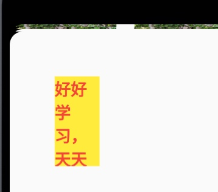
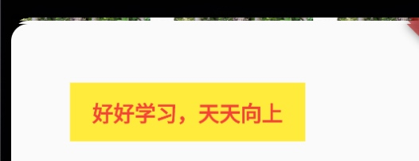
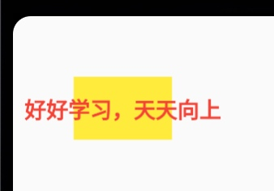
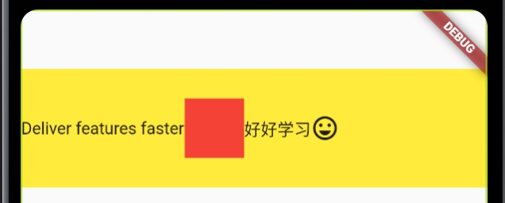
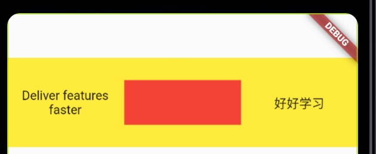
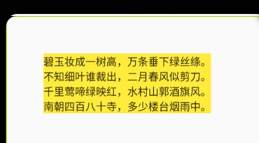
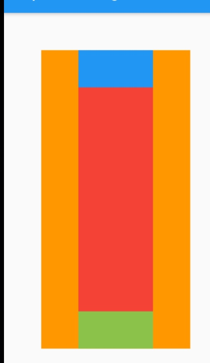
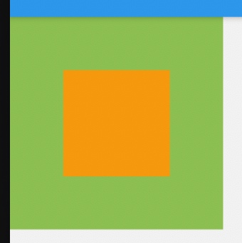
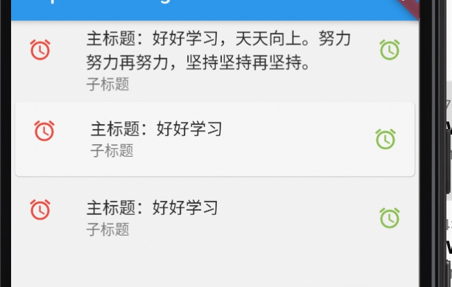

# 五、基础 Widgets

## Center

[Center](https://api.flutter.dev/flutter/widgets/Center-class.html) 将其`child`(子项)在自身内部居中显示。

* 如果 `Center` 的尺寸受到限制，且它的尺寸因子(`widthFactor` 和 `heightFactor`) 为`null`，那么 `Center` 尽可能大来显示其子项。




```Dart
Container(
  width: 50,
  height: 100,
  margin: EdgeInsets.fromLTRB(50, 50, 0, 0),
  color: Colors.yellow,
  child: Center(
          child: Text('好好学习，天天向上', style: TextStyle(color: Colors.red, fontSize: 18, fontWeight: FontWeight.bold),),
        ),
)
```


* 如果 `Center` 的尺寸不受限制，且它的尺寸因子(`widthFactor` 和 `heightFactor`) 为`null`，则它将在该尺寸中匹配其子项的尺寸。



```Dart
Container(
  width: 200,
  height: 50,
  margin: EdgeInsets.fromLTRB(50, 50, 0, 0),
  color: Colors.yellow,
  child: Center(
          child: Text('好好学习，天天向上', style: TextStyle(color: Colors.red, fontSize: 18, fontWeight: FontWeight.bold),),
        ),
)
```

* 如果(`widthFactor` 和 `heightFactor`) 不为`null`，则`Center`的相应尺寸将是其子项尺寸和尺寸因子的乘积。




```Dart
Container(
  child: Center(
          child: Text('好好学习，天天向上', style: TextStyle(color: Colors.red, fontSize: 18, fontWeight: FontWeight.bold),),
          widthFactor: 0.5,
          heightFactor: 2.0,
        ),
  color: Colors.yellow,
  margin: EdgeInsets.fromLTRB(50, 50, 0, 0),
)
```

## Row

[Row](https://api.flutter.dev/flutter/widgets/Row-class.html)水平布局组件，以水平的方式显示多个子项，`Row`里面的组件不能滚动。

如果 `Row` 只有一个子项，请考虑使用 [Align](https://api.flutter.dev/flutter/widgets/Align-class.html) 或 [Center](https://api.flutter.dev/flutter/widgets/Center-class.html)。

如下是 `Row` 的基本使用：




```Dart
Container(
  child: Row(
      children: [
        Text('Deliver features faster', textAlign: TextAlign.center),
        Container(width: 50, height: 50, color: Colors.red,),
        Text('好好学习', textAlign: TextAlign.center),
        const Icon(Icons.sentiment_very_satisfied),
      ],
    ),
  color: Colors.yellow,
  margin: EdgeInsets.fromLTRB(0, 50, 0, 0),
  height: 100,
)
```

如上可见 `Row` 是将其子项依次排列，并不会将子项填充可用空间。如需要使子项扩展至可用空间，需要用 [Expanded](https://api.flutter.dev/flutter/widgets/Expanded-class.html) 来包裹其子项。因此根据有没有使用`Expanded`，`Row`可以分为 灵活排列 和 非灵活排列。

如下借助 `Expanded` 使得 `Row` 的子项平分空间。



```Dart
Container(
  child: Row(
      children: [
        Expanded(child: Text('Deliver features faster', textAlign: TextAlign.center),),
        Expanded(child: Container(width: 50, height: 50, color: Colors.red,)),
        Expanded(child: Text('好好学习', textAlign: TextAlign.center)),
      ],
    ),
  color: Colors.yellow,
  margin: EdgeInsets.fromLTRB(0, 50, 0, 0),
  height: 100,
)
```

> 当 `Row` 的子项溢出时，如果未使用 `Expanded`，则会显示黑色的警告纹；如果使用了 `Expanded`，则会缩放调整子项的大小以适应空间。


## Column

[Column](https://api.flutter.dev/flutter/widgets/Column-class.html)即垂直布局组件，能够将子组件垂直排列。与 `Row` 组件基本类似。`Row` 和 `Column` 组件都继承自 [Flex](https://api.flutter.dev/flutter/widgets/Flex-class.html)。

关于 `Row` 和 `Column` 都有如下属性：



```Dart
Container(
  child: Column(
      mainAxisAlignment: MainAxisAlignment.spaceBetween,
      crossAxisAlignment: CrossAxisAlignment.start,
      mainAxisSize: MainAxisSize.min,
      children: [
        Text('碧玉妆成一树高，万条垂下绿丝绦。'),
        Text('不知细叶谁裁出，二月春风似剪刀。'),
        Text('千里莺啼绿映红，水村山郭酒旗风。'),
        Text('南朝四百八十寺，多少楼台烟雨中。'),
      ],
    ),
  color: Colors.yellow,
  margin: EdgeInsets.fromLTRB(50, 50, 0, 0),
)
```

* mainAxisAlignment：表示主轴上子项的对齐方式。crossAxisAlignment：表示辅轴上子项的对齐方式。主轴垂直于辅轴。

在 `Column` 组件中，主轴表示的是垂直方向，在 `Row` 组件中，主轴表示水平方向。

* mainAxisSize：主轴上所占用空间的大小。

## Expanded

[Expanded](https://api.flutter.dev/flutter/widgets/Expanded-class.html) 使得 `Row`、`Column` 和 `Flex` 的子项展开以填充主轴上的可用空间。如果扩展了多个子项，则会根据伸缩因子在可用空间之间进行分配。

` Expanded` 的 `child` 必须是`Row`、`Column`或`Flex`的后代，并且从 `Expanded` 到其封闭的 `Row`，`Column`或`Flex`的路径必须仅包含`StatelessWidgets`或`StatefulWidgets`（不能包含其他类型的小部件，例如`RenderObjectWidgets`） 。 

如下示例通过`Expanded`使得红色组件展开填充了剩余空间。



```Dart
class MysStatelessWidget extends StatelessWidget {

  const MysStatelessWidget({Key key}): super(key: key);
  
  @override
  Widget build(BuildContext context) {
    return Scaffold(
      appBar: AppBar(title: Text('Expanded Widget'),),
      body: Container(
        width: 200,
        height: 400,
        margin: EdgeInsets.fromLTRB(50, 50, 0, 0),
        color: Colors.orange,
        child: Column(
            children: [
              Container(color: Colors.blue, width: 100, height: 50,),
              Expanded(child: Container(color: Colors.red, width: 100, height: 50,),),
              Container(color: Colors.lightGreen, width: 100, height: 50,),
            ],
          ),
      ),
    );
  }
}
```

## Stack 

[Stack](https://api.flutter.dev/flutter/widgets/Stack-class.html) 即重叠布局，用于将其子项相对于其框的边缘定位。

`Stack`按顺序绘制其子项，第一个子项在底部。如果要更改子项绘画的顺序，则可以按照新的顺序重建带有子代的`stack`。如果您以这种方式对子项进行重新排序，请考虑为子项提供`non-null`键。 这些键将使框架将子级的基础对象移动到其新位置，而不是在其新位置重新创建它们。



```Dart
SizedBox(
  width: 200,
  height: 200,
  child: Stack(
      alignment: AlignmentDirectional.center,
      children: [
        Container(color: Colors.lightGreen,),
        Container(width: 100, height: 100, color: Colors.orange,),
      ],
    ),
)
```

`Stack` 的每个子项都是 `Positioned` 或 `non-positioned`。`Positioned`子项是包裹在[Positioned](https://api.flutter.dev/flutter/widgets/Positioned-class.html)组件中的子项，该组件具有至少一个`non-null`属性。`Stack`自身的大小将包含所有`non-positioned`子项，这些子项根据对齐方式进行定位。然后，根据`positioned`子项的`top`、
`right`、`bottom`、`left`属性相对于`stack`放置它们。。

* `Positioned` 组件用于控制`Stack`的子项放置的位置。


```Dart
SizedBox(
  width: 200,
  height: 200,
  child: Stack(
      alignment: AlignmentDirectional.center,
      children: [
        Image.asset(
          'images/pic1.png',
          scale: 1.0,
          width: 200,
          fit: BoxFit.fill, 
        ),
        Positioned(
          left: 20,
          right: 20,
          bottom: 10,
          child: Container(height: 50, color: Colors.orange,)
          ),
      ],
    ),
)
```

## ListTile

[ListTile](https://api.flutter.dev/flutter/material/ListTile-class.html)是`Material`库中的一种专用小组件。用于表示固定高度的单个行，包含一些文本和 前置、尾随 图标。

`ListTile` 通常在 `ListView`、`Column`、`Card`中使用。



```Dart
Column(
  children: [
    ListTile(
      title: Text('主标题：好好学习，天天向上。努力努力再努力，坚持坚持再坚持。'), 
      subtitle: Text('子标题'),
      leading: Icon(Icons.access_alarm, color: Colors.red,),
      trailing: Icon(Icons.access_alarm_outlined, color: Colors.lightGreen),
    ),
    Card(
      child: ListTile(
        title: Text('主标题：好好学习'), 
        subtitle: Text('子标题'),
        leading: Icon(Icons.access_alarm, color: Colors.red,),
        trailing: Icon(Icons.access_alarm_outlined, color: Colors.lightGreen),
      ),
    ),
    ListTile(
      title: Text('主标题：好好学习'), 
      subtitle: Text('子标题'),
      leading: Icon(Icons.access_alarm, color: Colors.red,),
      trailing: Icon(Icons.access_alarm_outlined, color: Colors.lightGreen),
    ),
  ],
)
```


## 学习博客

[布局 Widget](https://flutterchina.club/widgets/layout/)

[技术胖](http://jspang.com/detailed?id=43)

[Flutter 9种布局组件](https://juejin.cn/post/6919653632468221966)