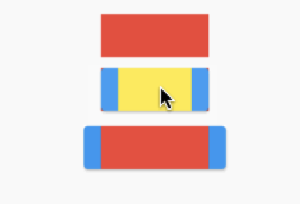
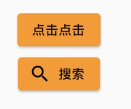
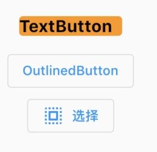
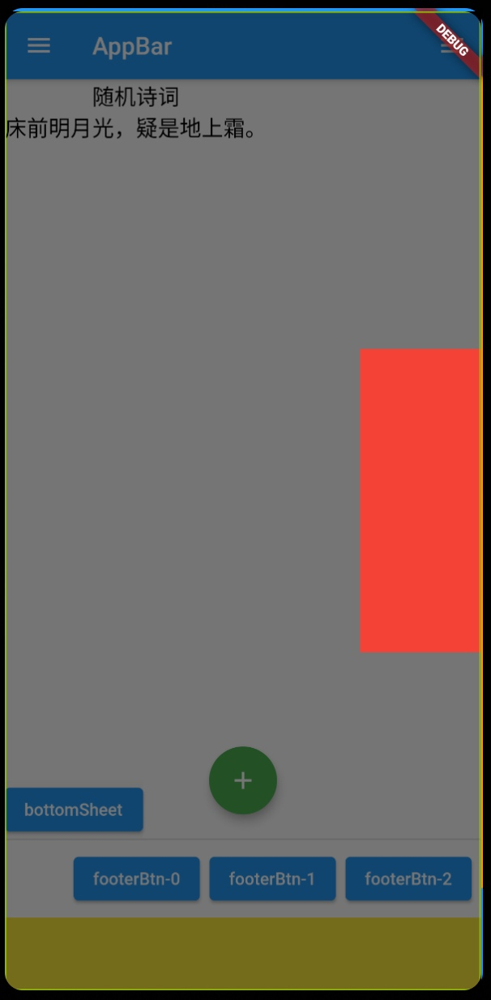
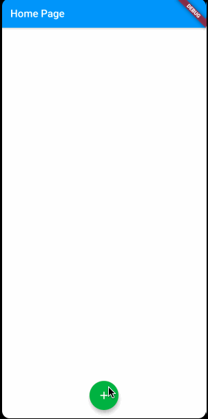
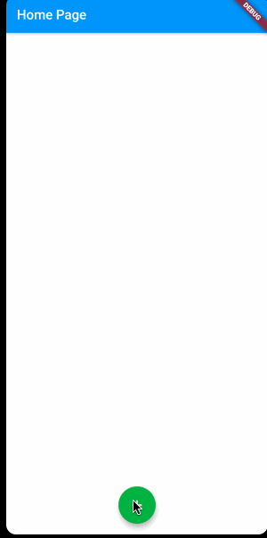

# 六、基础 Widgets


## ElevatedButton

[ElevatedButton](https://api.flutter.dev/flutter/material/ElevatedButton-class.html) 是 `Material Design` 风格的 `Button`，一个凸起的材质矩形按钮。

`ElevatedButton`是显示在`Material`组件上的标签子级。按下按钮时，高度提升会增加。

`ElevatedButton`会为原本主要是水平布局的布局添加尺寸，例如长列表或者或在较宽的空间中。避免在已经提升的内容(如对话框或卡片)上使用 `ElevatedButton`。

如下简单示例，`ElevatedButton`会增加它子项的宽度：



```Dart
Column(
  mainAxisAlignment: MainAxisAlignment.center,
  children: [
    Container(
      margin: EdgeInsets.fromLTRB(0, 0, 0, 10),
      height: 40,
      width: 100,
      color: Colors.red,
    ),
    Container(
      height: 40,
      width: 100,
      margin: EdgeInsets.fromLTRB(0, 0, 0, 10),
      color: Colors.red,
      child: ElevatedButton(
        onPressed: () {
        }, 
        child: Container(width: 100, height: 40, color: Colors.yellow,),
      ),
    ),
    ElevatedButton(
      onPressed: () {
      }, 
      child: Container(width: 100, height: 40, color: Colors.red,),
    ),
  ],
)
```

* 设置 `ElevatedButton` 的样式

`ElevatedButton.styleFrom` 是设置 `ButtonStyle` 的便捷方式。



```Dart
ElevatedButton(
  onPressed: () {
  }, 
  child: Text('点击点击'),
  style: ButtonStyle(
    backgroundColor: MaterialStateProperty.all<Color>(Colors.orange),   // 按钮的背景颜色
    overlayColor: MaterialStateProperty.all<Color>(Colors.red),   // 按钮的水波纹颜色
    foregroundColor: MaterialStateProperty.all<Color>(Colors.black),    // 字体颜色
  ),
)

ElevatedButton.icon(
  onPressed: (){
  }, 
  icon: Icon(Icons.search), 
  label: Text('搜索'),
  style: ElevatedButton.styleFrom(
    primary: Colors.orange,     // 按钮的背景颜色
    onPrimary: Colors.black,    // text 和 icon 的颜色
  ),
)
```
### 其它类型的按钮

* [TextButton](https://api.flutter.dev/flutter/material/TextButton-class.html) 一个没有阴影的简单平面按钮。

* [OutlinedButton](https://api.flutter.dev/flutter/material/OutlinedButton-class.html) 是具有边框轮廓的 `TextButton`。



```Dart
TextButton(
  onPressed: () {},
  child: Text('TextButton'),
  style: TextButton.styleFrom(
    primary: Colors.black,
    backgroundColor: Colors.orange,
    textStyle: TextStyle(fontSize: 18, fontWeight: FontWeight.bold,),
    padding: EdgeInsets.fromLTRB(0, 0, 10, 0),
    minimumSize: Size(25, 20),
  ),
)

OutlinedButton(
  onPressed: () {},
  child: Text('OutlinedButton'),
)

OutlinedButton.icon(
  onPressed: () {}, 
  icon: Icon(Icons.select_all), 
  label: Text('选择')
)
```

## Scaffold

`Scaffold` 译为脚手架，建筑领域中指保证施工过程顺利而搭建的工作平台，在编程领域中与此类似，脚手架的作用就像是一个功能强大的布局容器。

[Scaffold](https://api.flutter.dev/flutter/material/Scaffold-class.html) 实现基本的 `material Design` 视觉布局结构。`Scaffold`提供了用于显示`drawers` 和 底部`sheet`的API。

要显示一个持久的底页，请通过`Scaffold.of`获取当前`BuildContext`的`ScaffoldState`并使用`ScaffoldState.showBottomSheet`函数。

关于 `Scaffold` 组件，另外还可以参考：[Flutter开发之——Scaffold](https://blog.csdn.net/Calvin_zhou/article/details/115012228)、

如下是 `Scaffold` 组件的基本使用：



```Dart
class SampleAppPage extends StatelessWidget {

  const SampleAppPage({Key key}): super(key: key);

  Widget build(BuildContext context) {
    return Scaffold(
      // 顶部导航栏
      appBar: AppBar(title: Text('AppBar'),),
      // 悬浮按钮
      floatingActionButton: FloatingActionButton(onPressed: () {}, child: const Icon(Icons.add), backgroundColor: Colors.green,),
      floatingActionButtonLocation: FloatingActionButtonLocation.centerFloat,
      // 介于[body]和[bottomNavigationBar]之间的一组Widget
      persistentFooterButtons: createBtns(),
      // 左右抽屉
      drawer: Container(width: 100,height: 250,color: Colors.blue,),
      endDrawer: Container(width: 100,height: 250,color: Colors.red,),
      // 底部标签栏
      bottomNavigationBar: Container(height: 60, color: Colors.yellow,),
      // 底部持久化提示框
      bottomSheet: ElevatedButton(onPressed: () {}, child: Text('bottomSheet'),),
      // 背景颜色
      backgroundColor: Colors.white,
      // 内容区域
      body: PoemCard(textColor: Colors.black, poemStr: '床前明月光，疑是地上霜。'),
    );
  }

  List<Widget> createBtns() {
    var btns = <Widget>[];
    for(int i = 0; i < 3; i++) {
      var btn = ElevatedButton(onPressed: (){ }, child: Text('footerBtn-$i'),);
      btns.add(btn);
    }
    return btns;
  }
}
```

## Navigator

* [Navigator](https://api.flutter.dev/flutter/widgets/Navigator-class.html) 是用 `Stack` 规则管理一组子组件的组件。

* 移动应用程序通常通过称为 `screens`(屏幕) 或 `pages`(页面) 的全屏元素来显示其内容。在`Flutter`中，这些元素称为 `routes`(路由)，由 `Navigator`组件管理。

* `navigator` 管理 [Route](https://api.flutter.dev/flutter/widgets/Route-class.html) 对象的 `Stack`，并提供两种管理 `stack` 的方法：声明式API `Navigator.pages` 或 命令式API `Navigator.push` 和 `Navigator.pop`。

### Route

一个 [route](https://api.flutter.dev/flutter/widgets/Route-class.html) 是一个屏幕或页面的抽象，`Navigator`是管理 `route` 的 `Widget`。`Navigator`可以通过 `route` 入栈和出栈来实现页面之间的跳转。


### 使用 Pages API

`Navigator` 会将其 `Navigator.pages` 转换为 `Routes`的`Stack`。 `Navigator.pages` 中的更改将触发对`Routes` 的 `Stack`的更新。`Navigator`将更新其`Routes`，以匹配其 `Navigator.pages` 的新配置。要使用此API，需要创建一个`Page`子类，并为`Navigator.pages`定义一个`Pages`列表。在 `pop`(弹出)的情况下，还需要 `Navigator.onPopPage` 回调来正确清理 `input pages`(输入页面)。

默认情况下，`Navigator`将使用 `DefaultTransitionDelegate` 来确定 `routes` 如何在屏幕内或屏幕外过渡。要对其进行自定义，请定义一个 `TransitionDelegate` 子类，并将其提供给`Navigator.transitionDelegate`。

#### 显示full-screen route

尽管可以直接创建`navigator`，但是最常见的是使用由 `Router` 创建的 `navigator`，`Router`本身是由 `WidgetsApp` 或 `MaterialApp` 组件创建和配置的。可以使用 `Navigator.of` 引用该`navigator`。

`MaterialApp` 是设置事物的最简单方法。 `MaterialApp`的 `home` 属性成为`Navigator's stack`底部的`route`。

如下使用 `MaterialPageRoute` 实例向 `Stack` 上 `push` 新的 `route`，然后使用 `Navigator.pop` 方法 `pop` 弹出：



```Dart
void main() {
  runApp(MyApp());
}

class MyApp extends StatelessWidget {

  @override
  Widget build(BuildContext context) {
    return const MaterialApp(home: HomePage(),);
  }
}
```

```Dart
class HomePage extends StatelessWidget {

  const HomePage({Key key}): super(key: key);

  Widget build(BuildContext context) {
    return Scaffold(
      appBar: AppBar(title: Text('Home Page'),),
      floatingActionButton: FloatingActionButton(onPressed: () {
        Navigator.push(
          context, 
          MaterialPageRoute(builder: 
            (BuildContext context) { 
              return TwoPage(); 
            }
          )
        );
      }, child: const Icon(Icons.add), backgroundColor: Colors.green,),
      floatingActionButtonLocation: FloatingActionButtonLocation.centerFloat,
      backgroundColor: Colors.white,
    );
  }
}

class TwoPage extends StatelessWidget {
  const TwoPage({Key key}): super(key: key);

  Widget build(BuildContext context) {
    return Scaffold(
      appBar: AppBar(title: Text('Two Page')),
      body: Center(
        child: TextButton(
          child: Text('返回', style: TextStyle(color: Colors.black, fontSize: 22),),
          onPressed: () { Navigator.pop(context); },
        ),
      ),
    );
  }
}
```

#### 使用命名的 navigator routes

移动应用程序经常管理大量`routes`，通常最容易按名称引用它们。按照惯例，`Route names`使用类似路径的结构（例如`'/a/b/c'`）。该应用程序的首页 `route` 默认命名为 '/' 。

可以使用 `Map<String, WidgetBuilder>` 创建 `MaterialApp`，该 `Map<String, WidgetBuilder>` 从 `route` 的名称映射到 将创建该`route`的构建器函数。`MaterialApp`使用此映射为其导航器的 `onGenerateRoute` 回调创建一个值。



```Dart
void main() {
  runApp(MaterialApp(
    home: HomePage(),
    routes: <String, WidgetBuilder> {
      '/a': (BuildContext context) => TwoPage(titleStr: '第二个页面'),
    },
  ));
}
```

```Dart
class HomePage extends StatelessWidget {
  Widget build(BuildContext context) {
    return Scaffold(
      appBar: AppBar(title: Text('Home Page'),),
      floatingActionButton: FloatingActionButton(onPressed: () {
        Navigator.pushNamed(context, '/a');
      }, child: const Icon(Icons.add), backgroundColor: Colors.green,),
      floatingActionButtonLocation: FloatingActionButtonLocation.centerFloat,
      backgroundColor: Colors.white,
    );
  }
}

class TwoPage extends StatelessWidget {
  const TwoPage({Key key, this.titleStr}): super(key: key);

  final String titleStr;

  Widget build(BuildContext context) {
    return Scaffold(
      appBar: AppBar(title: Text(titleStr)),
      body: Center(
        child: TextButton(
          child: Text('返回', style: TextStyle(color: Colors.black, fontSize: 22),),
          onPressed: () { Navigator.pop(context); },
        ),
      ),
    );
  }
}
```


## 学习博客

[Basic widgets](https://flutter.dev/docs/development/ui/widgets/basics)

[material.io/design/components/buttons.html](https://material.io/components/buttons#hierarchy-and-placement)

[自定义Button](https://blog.csdn.net/Calvin_zhou/article/details/114919470?ops_request_misc=%257B%2522request%255Fid%2522%253A%2522161795154716780265479162%2522%252C%2522scm%2522%253A%252220140713.130102334.pc%255Fall.%2522%257D&request_id=161795154716780265479162&biz_id=0&utm_medium=distribute.pc_search_result.none-task-blog-2~all~first_rank_v2~rank_v29-5-114919470.first_rank_v2_pc_rank_v29&utm_term=ElevatedButton)

[老孟 * Scaffold](http://laomengit.com/flutter/widgets/Scaffold.html#scaffold)