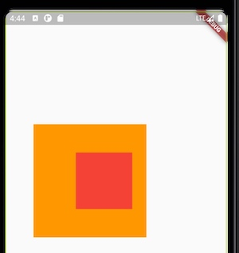
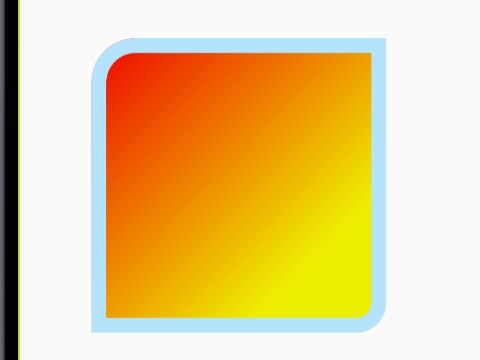
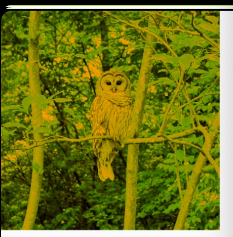
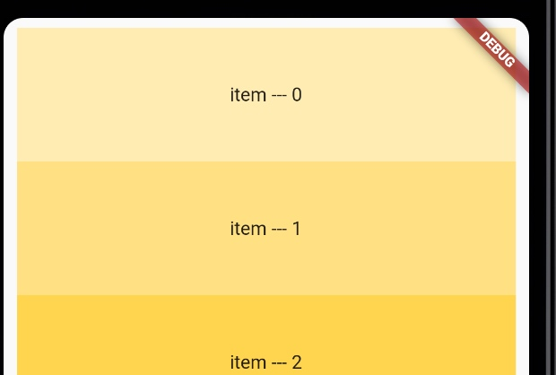
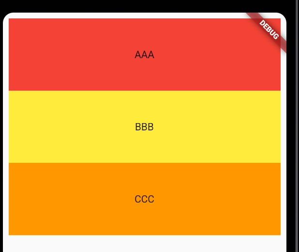
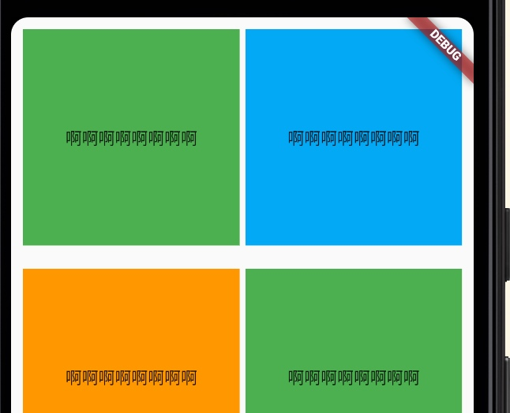

# 四、基础 Widgets

## Container

[Container](https://api.flutter.dev/flutter/widgets/Container-class.html) 是一个方便的`widget`，它结合了常见的`painting`(绘制)、`positioning`(定位)和 `sizing`(调整大小)。

许多布局自由地使用`Containers`的``padding``来分隔`widgets`，或者添加 `borders`(边框) 或 `margins`(边距)。可以通过将整个布局放入 `Container` 并更改其背景颜色或图像来更改设备的背景。


### Container的基本属性



```Dart
class MyApp extends StatelessWidget {
  @override
  Widget build(BuildContext context) {
    return MaterialApp(
      title: 'text widget',
      home: Scaffold(
        body: Container(
              width: 200.0,
              height: 200.0,
              margin: const EdgeInsets.fromLTRB(50, 200, 0, 0),
              padding: const EdgeInsets.fromLTRB(0, 0, 25, 0),
              color: Colors.orange,
              alignment: Alignment.centerRight,
              child: Container(
                width: 100.0,
                height: 100.0,
                color: Colors.red,
                alignment: Alignment.centerLeft,
              ),
              ),
      ),
    );
  }
}
```

* `width` 和 `height`，用于设置`Container`自身的宽度和高度，若未设置则会自动拉伸填充满。
* `color`，用于设置`Container`自身的背景颜色，如果使用 `decoration` 此属性必须为 `null`。
* `margin`，是指`Container`自身和外部元素的距离，若未设置则定位在左上角。
* `padding`，指的是`Container`自身内边缘和其 `child` 内容的距离。
* `alignment`，针对的是 `Container` 内 `child` 的对齐方式。

### decoration

[decoration](https://api.flutter.dev/flutter/widgets/Container/decoration.html) 属性用于在`child`(子项)后面绘制内容，它接收一个 [Decoration](https://api.flutter.dev/flutter/painting/Decoration-class.html)类型，该类型是一个抽象类，具体实现通过 [BoxDecoration](https://api.flutter.dev/flutter/painting/BoxDecoration-class.html)类，主要用于设置边框、背景色、圆角、阴影、渐变色、背景图片等。



```Dart
Container(
  width: 200,
  height: 200.0,
  margin: const EdgeInsets.fromLTRB(50, 200, 0, 0),
  decoration: BoxDecoration(
    color: Colors.lightBlue,
    border: Border.all(width: 10.0, color: const Color(0xfffb3e3fc)),
    borderRadius: BorderRadius.only(topLeft: Radius.circular(30), bottomRight: Radius.circular(20)),
    gradient: LinearGradient(
        begin: Alignment.topLeft, 
        end: Alignment(0.5,0.5),
        colors: [const Color(0xffee0000), const Color(0xffeeee00)],
      )
  ),
),
```

### constraints

[constraints](https://api.flutter.dev/flutter/widgets/Container/constraints.html)，用于约束其`Child`(子项)，它接收一个[BoxConstraints](https://api.flutter.dev/flutter/rendering/BoxConstraints-class.html)类型。


## Text

[Text](https://api.flutter.dev/flutter/widgets/Text-class.html) 表示单一样式的文本。如需要设置富文本样式需使用[RichText](https://api.flutter.dev/flutter/widgets/RichText-class.html)


```Dart
Text(
  '床前明月光疑是地上霜举头望明月低头思故乡',   // 设置普通文本内容
  textAlign: TextAlign.right,   // 对齐方式
  maxLines: 3,    // 显示最大行数
  // overflow: TextOverflow.ellipsis,   // 文本溢出时末尾样式
  style: TextStyle(
      color: Colors.yellow,   // 文字颜色
      fontSize: 22.0,   // 字体大小
      fontWeight: FontWeight.bold,    // 设置文本粗细
      decoration: TextDecoration.underline,   // 设置文本下划线
      decorationStyle: TextDecorationStyle.dotted,    // 如何绘制下划线
    ),
)
```

## Image

[Image](https://api.flutter.dev/flutter/widgets/Image-class.html) 是显示图像的小组件。它提供了如下几种构造函数来指定图片：

* `new Image`，用于从`ImageProvider`获取图像。
* `new Image.asset`，用于使用`key`从`AssetBundle`获取图像。
* `new Image.network`，用于从URL获取图像。
* `new Image.file`，用于从文件获取图像。
* `new Image.memory`，用于从Uint8List获得图像。

支持的图片格式有：JPEG, PNG, GIF,WebP,BMP，WBMP。

* 获取本地图片，如下在项目根目录下建立 `images`文件夹 -> 修改 [pubspec.yaml](https://api.flutter.dev/flutter/services/AssetBundle-class.html) 文件

```Dart
Image.asset(
  'images/pic1.png', 
  width: 100, 
  height: 200,
  scale: 1.0,
  alignment: Alignment.centerLeft,
  fit: BoxFit.contain,    // 设置图片的伸缩模式 
)
```


* 加载网络图片

图片混合模式（`colorBlendMode`）和`color`属性配合使用，能让图片改变颜色，里边的模式非常的多，产生的效果也是非常丰富的。

```Dart
Image(
  image: NetworkImage('https://flutter.github.io/assets-for-api-docs/assets/widgets/owl.jpg'),
  width: 100,
  height: 100,
  repeat: ImageRepeat.repeat,
)
```



```Dart
Image.network(
  'https://flutter.github.io/assets-for-api-docs/assets/widgets/owl-2.jpg',
  width: 300,
  fit: BoxFit.fitWidth,
  color: Colors.orange,
  colorBlendMode: BlendMode.darken,
)
```

## ListView

[ListView](https://api.flutter.dev/flutter/widgets/ListView-class.html) 是线性排列的子项的可滚动列表。

有如下四种方式来构造 `ListView`：

* 默认构造函数接收显式的`List<Widget>`子类。此构造函数适用于具有少量`children`的列表视图，因为构建`List`需要为每个可能显示在列表视图中的子视图做工作，而不是仅对那些实际可见的子级进行处理。

* `ListView.builder` 构造函数需要一个`IndexedWidgetBuilder`，它按需构建`children`。 此构造函数适用于具有大量（或无限多个）子级的列表视图，因为仅针对那些实际可见的子级调用该生成器。

* `ListView.separated` 构造函数采用两个 `IndexedWidgetBuilders`：`itemBuilder`会根据需要构建子项；而 `spliterBuilder` 同样会构建出现在子项之间的分隔器子项。此构造函数适用于具有固定子级数的列表视图。

* `ListView.custom` 构造函数采用 `SliverChildDelegate`，该代理提供自定义子模型其他方面的能力。 例如，`SliverChildDelegate`可以控制用于估计实际上不可见的`children`的大小的计算。

### ListView的基本属性

* `itemExtent`，如果不为null，则强制让`child`(子项)在滚动方向具有给定的大小。指定`itemExtent`比让`child`确定自己的范围更有效，因为滚动机制可以利用`child`范围的预设值来节省工作。
* `scrollDirection`，用于指定列表的滚动方向。
* `padding`，用于设置`ListView`的外边距。


### 采用默认构造函数创建 ListView




```Dart
ListView(
  itemExtent: 100,
  padding: const EdgeInsets.all(10),
  children: createItems(),
)

List<Widget> createItems() {
  var items = <Widget>[];
  for (var i = 0; i < 10; i++) {
    var item = Container(
              alignment: Alignment.center,
              color: Colors.amber[(100 * (i + 1))],
              child: Text('item --- $i'),
            );
    items.add(item);
  }
  return items;
}
```

### 使用 ListView.builder 来构建 ListView



```Dart
final List<String> dataStr = ['AAA', 'BBB', 'CCC'];
final List<Color> dataColor = [Colors.red, Colors.yellow, Colors.orange];
  
ListView.builder(
  padding: const EdgeInsets.all(8),
  itemCount: dataStr.length,
  itemBuilder: (BuildContext context, int index) {
    return Container(
      height: 100,
      alignment: Alignment.center,
      color: dataColor[index],
      child: Text(dataStr[index]),
    );
  },
)
```

## GridView

[GridView](https://api.flutter.dev/flutter/widgets/GridView-class.html) 网格列表，将`widget`布置为二维列表，当 `GridView` 检测到其内容太长而无法容纳渲染框时，它将自动滚动。

最常用的网格布局有：[GridView.count](https://api.flutter.dev/flutter/widgets/GridView/GridView.count.html)，它在横轴上创建具有 固定数量 的平铺的布局；[GridView.extent](https://api.flutter.dev/flutter/widgets/GridView/GridView.extent.html) 创建具有最大横轴范围的平铺布局，允许指定图块的最大像素宽度。自定义的 [SliverGridDelegate](https://api.flutter.dev/flutter/rendering/SliverGridDelegate-class.html) 可以产生子级的任意2D排列，包括未对齐或重叠的排列。

要创建具有大量（或无限个）子项的网格，请对 `GridDelegate` 使用带有`SliverGridDelegateWithFixedCrossAxisCount` 或`SliverGridDelegateWithMaxCrossAxisExtent` 的 [GridView.builder](https://api.flutter.dev/flutter/widgets/GridView/GridView.builder.html) 构造函数。

若要使用自定义 `SliverChildDelegate`，请使用[GridView.custom](https://api.flutter.dev/flutter/widgets/GridView/GridView.custom.html)。

### GridView.count 的使用

通过 `GridView.count` 创建具有两列的 `GridView`。



```Dart
List<Widget> createItems() {
  var dataColor = [Colors.orange, Colors.green, Colors.lightBlue];
  var items = <Widget>[];
  for (var i = 0; i < 3; i++) {
    var item = Container(
      alignment: Alignment.center,
      child: const Text('啊啊啊啊啊啊啊啊'),
      color: dataColor[i],
    );
    items.add(item);
  }
  return items;
}

GridView.count(
  primary: false,
  padding: const EdgeInsets.all(10),    // 设置网格列表的外边距
  crossAxisSpacing: 5,    // 设置每行相邻子项之间的间距
  mainAxisSpacing: 20,    // 设置每列之间的间距
  crossAxisCount: 2,      // 网格的列数，相当于一行放置的网格数量。
  children: createItems(),
)
```


### GridView.builder 的使用

```Dart
GridView.builder(
  gridDelegate: SliverGridDelegateWithFixedCrossAxisCount(
    crossAxisCount: 3,
    mainAxisSpacing: 10,
    crossAxisSpacing: 20,
    childAspectRatio: 1
  ), 
  itemCount: 30,
  itemBuilder: (BuildContext context, int index) {
    return Image.network(
      'https://flutter.github.io/assets-for-api-docs/assets/widgets/owl-2.jpg',
      fit: BoxFit.fitWidth,
    );
  }
);
```

## 参考博客

[Widgets 目录](https://flutterchina.club/widgets/)

[Flutter Widget catalog](https://flutter.dev/docs/development/ui/widgets)

[技术胖](http://jspang.com/detailed?id=42#toc214)